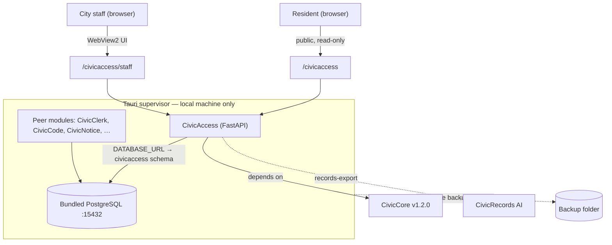

# CivicAccess

CivicAccess is the CivicSuite module for accessibility, plain-language, multilingual, and ADA Title II review-support workflows.

> **v0.4.0 · early release.** CivicAccess does **not** give legal advice, certify ADA compliance, issue official translations, or publish anything on its own — your staff, ADA coordinator, translators, and legal counsel always make the final call.

This README has two audiences:

- **Civic staff (clerks, communicators, ADA coordinators)** — see the [User Manual, Part 1](USER-MANUAL.md#part-1--for-civic-staff) or the [landing page](docs/index.html). Short version below.
- **IT & technical staff** — architecture, API, persistence, and security are below.

---

## For civic staff (the short version)

CivicAccess helps your office put out public notices everyone can read — and keep a record proving you checked.

- Paste a draft into the **public checker** to get instant, plain-language fixes. Nothing is saved — it's a safe place to try things.
- To keep a review **on the record**, save it in the **staff workspace** and export a copy you can hand to a public-records request.
- It also rewrites jargon, drafts translations for a human reviewer, and walks ADA Title II reviews — but never publishes anything on its own.

Full walkthrough: [User Manual, Part 1](USER-MANUAL.md#part-1--for-civic-staff).

---

## For IT & technical staff

CivicAccess is a deterministic FastAPI module (Python), pinned to the published CivicCore v1.2.0 release wheel — no model/LLM calls and no outbound network calls, so output is reproducible.

### Architecture

In CivicSuite Windows Local, a Tauri supervisor runs CivicAccess (and peer modules) against a bundled PostgreSQL on `127.0.0.1:15432`; CivicAccess uses a dedicated `civicaccess` schema. The supervisor's backup captures the whole data directory, so module data rides along.



### What it provides

- A **stateless public accessibility checker** (`/civicaccess`) that flags WCAG-aligned issues with actionable, standard-referenced fixes — no persistence, no token.
- A **token-guarded staff workspace** (`/civicaccess/staff`) for saving reviews and building records-ready exports.
- Plain-language rewrites that preserve source/rewrite provenance.
- Multilingual draft variants explicitly marked for human review.
- ADA Title II review-support checklists (without claiming certification).
- Accessible-form and tagged-PDF expectation checks, and a staff publication workflow.
- A persisted **audit trail** of every write/export, and integration contracts for downstream publishers.

### Runtime API

| Method & path | Auth | Persists? | Purpose |
|---|---|---|---|
| `GET /` · `GET /health` | — | no | Status, boundaries, versions |
| `GET /ready` · `GET /api/v1/civicaccess/readiness` | — | no | Persistence readiness gate |
| `GET /civicaccess` · `GET /civicaccess/staff` | — | no | Public checker / staff workspace (UI) |
| `POST /api/v1/civicaccess/analyze` | — | no | Stateless accessibility analysis |
| `POST /api/v1/civicaccess/review` | **token** | **yes** | Save a review record (+ audit) |
| `GET /api/v1/civicaccess/reviews` · `GET …/reviews/{id}` | — | no | List / retrieve saved reviews |
| `POST /api/v1/civicaccess/reviews/{id}/records-export` | **token** | **yes** (audit) | Records-ready export (+ audit) |
| `GET /api/v1/civicaccess/integration-contracts` | — | no | Published integration contracts |
| `POST /api/v1/civicaccess/plain-language` · `…/language-variant` | — | no | Plain-language rewrite / multilingual draft |
| `POST /api/v1/civicaccess/forms` · `…/publishing-workflow` | — | no | Accessible-form checks / publication workflow |
| `POST /api/v1/civicaccess/ada-title-ii` · `…/tagged-pdf` · `…/export` | — | no | ADA Title II checklist / tagged-PDF / export checklist |

Token-guarded writes require `X-CivicAccess-Write-Token` matching `CIVICACCESS_TRUSTED_WRITE_TOKEN` (constant-time compare): missing/invalid → `403`, guard not configured → `503`. The token is never embedded in served HTML — the staff page provides a field where an operator pastes it.

### Persistence & configuration

| Variable | Purpose |
|---|---|
| `DATABASE_URL` | Shared CivicCore PostgreSQL (supervisor-injected) — the production default |
| `CIVICACCESS_REVIEW_DB_URL` | Explicit SQLAlchemy URL override |
| `CIVICACCESS_DATA_DIR` | Directory for the SQLite dev fallback (`data/civicaccess-reviews.db`) |
| `CIVICACCESS_TRUSTED_WRITE_TOKEN` | **Required** server secret for persistent writes |

Resolution order: `CIVICACCESS_REVIEW_DB_URL` → `DATABASE_URL` (converted to a sync psycopg2 URL) → SQLite dev fallback. Use the `civicaccess-db-status` console script with an explicit URL to preflight a database.

### Security

Persistence-write routes require the trusted-write token (constant-time compare, fails closed); read and stateless-analysis routes are open. Every write/export persists an `audit_events` row; `review.create`'s audit is committed atomically with the record. No model/LLM or outbound network calls. Review + audit data live in the shared Postgres cluster and are captured by the supervisor's wholesale `Data/` backup. See [SECURITY.md](SECURITY.md).

### Developer quickstart

```powershell
python -m venv .venv
.\.venv\Scripts\Activate.ps1
python -m pip install https://github.com/CivicSuite/civiccore/releases/download/v1.2.0/civiccore-1.2.0-py3-none-any.whl
python -m pip install -e ".[dev]"
python -m pytest -q
# Full release gate (requires a real PostgreSQL):
$env:CIVICACCESS_POSTGRES_TEST_URL = "postgresql+psycopg2://USER:PW@HOST:PORT/DB"
bash scripts/verify-release.sh
```

### Integration

CivicAccess **depends on CivicCore** (CivicCore does not depend on CivicAccess). It publishes contracts at `/api/v1/civicaccess/integration-contracts`, hands records exports to **CivicRecords AI**, and supports downstream publishers (zone, plan, permit, inspect, grants, procure).

### Release status

`v0.4.0` is an early release; probe gaps #1–#4 (clean install, staff/public authz, audit logging, backup/restore durability) are closed with evidence — see [PROBE-PROGRESS.md](PROBE-PROGRESS.md). City-core membership (desktop registry record, 6-module profile) and a clean-VM accessibility acceptance pass are later phases. The earlier `v1.0.0` release was published in error and is retained only as historical evidence; see [docs/release-integrity-correction-2026-05-21.md](docs/release-integrity-correction-2026-05-21.md).

## License

Code is Apache 2.0. Documentation is CC BY 4.0.
