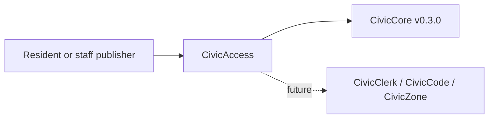

# CivicAccess User Manual

## For Residents And Municipal Decision-Makers

CivicAccess helps cities make public information easier to read, reach, translate, and preserve. It supports accessibility review, plain-language rewrites, multilingual variants, and records-ready export checklists.

Current state: `0.1.1` accessibility foundation release plus production-depth review persistence slice. The module includes deterministic sample checks, optional database-backed review records, a public sample UI at `/civicaccess`, and `civiccore==0.3.0` dependency alignment. It does not provide legal advice, certified ADA compliance, official translation certification, live LLM calls, production document ingestion, or final publication approval.

## For IT And Technical Staff

CivicAccess is a FastAPI Python package pinned to `civiccore==0.3.0`. The current runtime exposes:

- `GET /`
- `GET /health`
- `GET /civicaccess`
- `POST /api/v1/civicaccess/review`
- `GET /api/v1/civicaccess/reviews/{review_id}` when `CIVICACCESS_REVIEW_DB_URL` is configured
- `POST /api/v1/civicaccess/plain-language`
- `POST /api/v1/civicaccess/language-variant`
- `POST /api/v1/civicaccess/export`

Set `CIVICACCESS_REVIEW_DB_URL` to persist review requests, findings, WCAG references, and disclaimers. Leave it unset for deterministic sample behavior.

Run local verification with:

```powershell
python -m pip install -e ".[dev]"
python -m pytest -q
bash scripts/verify-release.sh
```

## Architecture



CivicAccess depends on CivicCore. CivicCore does not depend on CivicAccess.
