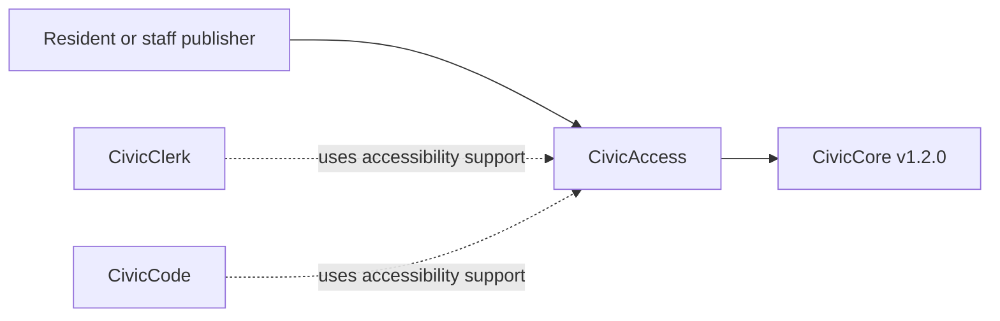

# CivicAccess User Manual

## For Residents And Municipal Decision-Makers

CivicAccess helps cities make public information easier to read, reach, translate, review, and preserve. It supports accessibility review, accessible forms, public publishing workflows, plain-language rewrites, multilingual draft variants, ADA Title II review support, tagged-PDF expectations, and records-ready export checklists.

Current state: `0.2.0` corrective demotion state. CivicAccess includes deterministic checks, optional database-backed review records, an API-backed public review UI at `/civicaccess`, and CivicCore v1.2.0 release-wheel alignment. The previous `v1.0.0` release was published in error and is superseded by this honest sub-1.0.0 label. CivicAccess does not provide legal advice, certified ADA compliance, official translation certification, live LLM calls, or final publication approval.

## For IT And Technical Staff

CivicAccess is a FastAPI Python package pinned to the published `CivicCore v1.2.0` release wheel. The current runtime exposes:

- `GET /`
- `GET /health`
- `GET /civicaccess`
- `POST /api/v1/civicaccess/review`
- `GET /api/v1/civicaccess/reviews/{review_id}` when `CIVICACCESS_REVIEW_DB_URL` is configured
- `POST /api/v1/civicaccess/forms`
- `POST /api/v1/civicaccess/publishing-workflow`
- `POST /api/v1/civicaccess/plain-language`
- `POST /api/v1/civicaccess/language-variant`
- `POST /api/v1/civicaccess/ada-title-ii`
- `POST /api/v1/civicaccess/tagged-pdf`
- `POST /api/v1/civicaccess/export`

Set `CIVICACCESS_REVIEW_DB_URL` to persist review requests, findings, WCAG references, disclaimers, and next steps. Leave it unset for deterministic sample behavior.

Run local verification with:

```powershell
python -m pip install https://github.com/CivicSuite/civiccore/releases/download/v1.2.0/civiccore-1.2.0-py3-none-any.whl
python -m pip install -e ".[dev]"
python -m pytest -q
bash scripts/verify-release.sh
```

## Architecture



CivicAccess depends on CivicCore. CivicCore does not depend on CivicAccess.
