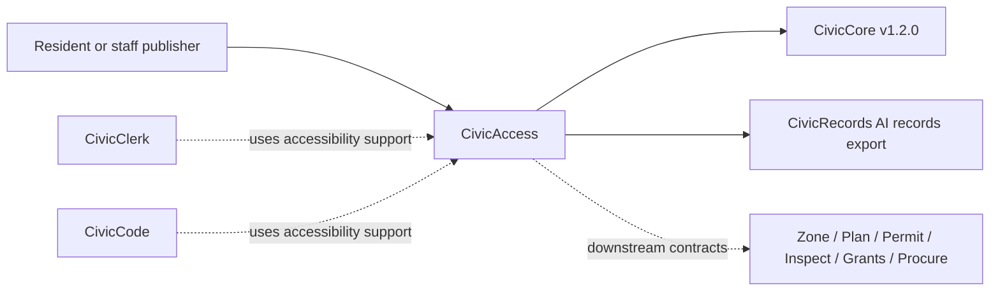

# CivicAccess User Manual

## For Residents And Municipal Decision-Makers

CivicAccess helps cities make public information easier to read, reach, translate, review, and preserve. It supports accessibility review, accessible forms, public publishing workflows, plain-language rewrites, multilingual draft variants, ADA Title II review support, tagged-PDF expectations, and records-ready export checklists.

Current state: `0.3.0` standalone readiness candidate. CivicAccess includes deterministic checks, local database-backed review records, readiness gates, an API-backed public review UI at `/civicaccess`, a staff review/export workspace at `/civicaccess/staff`, and CivicCore v1.2.0 release-wheel alignment. The previous `v1.0.0` release was published in error and remains historical evidence only. CivicAccess does not provide legal advice, certified ADA compliance, official translation certification, live LLM calls, or final publication approval.

## For IT And Technical Staff

CivicAccess is a FastAPI Python package pinned to the published `CivicCore v1.2.0` release wheel. The current runtime exposes:

- `GET /`
- `GET /health`
- `GET /ready`
- `GET /civicaccess`
- `GET /civicaccess/staff`
- `GET /api/v1/civicaccess/readiness`
- `POST /api/v1/civicaccess/review`
- `GET /api/v1/civicaccess/reviews`
- `GET /api/v1/civicaccess/reviews/{review_id}`
- `POST /api/v1/civicaccess/reviews/{review_id}/records-export`
- `GET /api/v1/civicaccess/integration-contracts`
- `POST /api/v1/civicaccess/forms`
- `POST /api/v1/civicaccess/publishing-workflow`
- `POST /api/v1/civicaccess/plain-language`
- `POST /api/v1/civicaccess/language-variant`
- `POST /api/v1/civicaccess/ada-title-ii`
- `POST /api/v1/civicaccess/tagged-pdf`
- `POST /api/v1/civicaccess/export`

By default, CivicAccess persists review requests, findings, WCAG references, disclaimers, and next steps in `data/civicaccess-reviews.db` under the process working directory. Set `CIVICACCESS_DATA_DIR` to choose a different local data directory, or set `CIVICACCESS_REVIEW_DB_URL` for an explicit SQLAlchemy database URL. Use `civicaccess-db-status` with the same explicit database URL when preflighting a non-default database.

Before public use, check `/ready` or `/api/v1/civicaccess/readiness`. The readiness gate is `ready` when the local review database schema can be created and verified.

Run local verification with:

```powershell
python -m pip install https://github.com/CivicSuite/civiccore/releases/download/v1.2.0/civiccore-1.2.0-py3-none-any.whl
python -m pip install -e ".[dev]"
python -m pytest -q
bash scripts/verify-release.sh
```

## Architecture



CivicAccess depends on CivicCore. CivicCore does not depend on CivicAccess.
