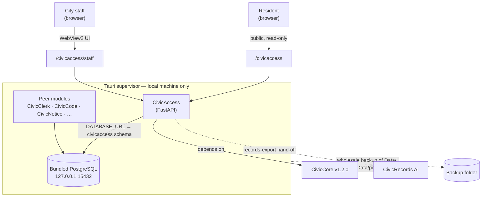
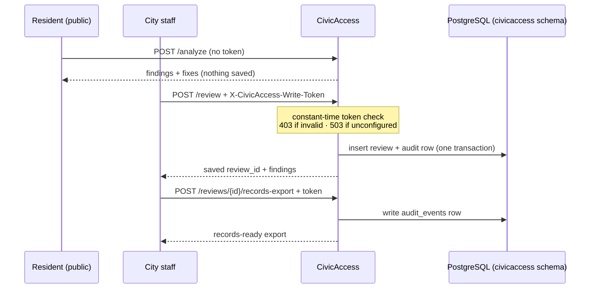
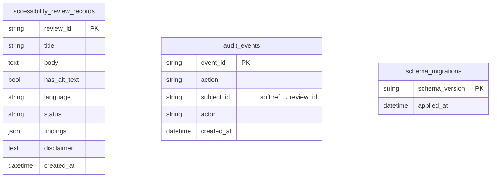

# CivicAccess User Manual

**Version 0.4.0 · early release**
CivicAccess is the accessibility, plain-language, multilingual, and ADA Title II review-support module for CivicSuite.

This manual has two parts. Read the one that fits your role:

- **[Part 1 — For Civic Staff](#part-1--for-civic-staff)** — clerks, communicators, ADA coordinators. Plain English, no setup.
- **[Part 2 — For IT & Technical Staff](#part-2--for-it--technical-staff)** — architecture, runtime, data model, security, and operations.

---

## Part 1 — For Civic Staff

### What CivicAccess is for

CivicAccess helps your office put out public notices, forms, and documents that **everyone can read** — and keep a clean record proving you checked. It is a staff tool that gives advice and does the busywork; **you and your ADA coordinator always make the final call.**

### What you can do with it

| You want to… | CivicAccess gives you… |
|---|---|
| Know if a notice is hard to read | A check that flags missing titles, images without descriptions, and dense wording — each with a specific fix |
| Cut the jargon | A plain-language rewrite (e.g. "remit payment prior to the deadline" → "pay before the deadline") |
| Reach non-English readers | Draft translations, clearly marked for a qualified human reviewer to approve |
| Publish an accessible form or PDF | A checklist of what an accessible form or tagged PDF needs |
| Handle an ADA Title II review | A step-by-step review-support checklist |
| Answer a records request | A saved, exportable record of every review, with a time-stamp of who did what |

### How you'll use it day to day

There are two places to work, and the difference matters:

- The **public checker** is for trying things out — it forgets everything when you leave.
- The **staff workspace** is for keeping a permanent, official record you can produce later.

Your IT team will give you the link to each.

1. Open the **public checker**. Paste in a draft notice and run the check. You'll get a list of plain-language fixes — nothing is saved, so it's a safe place to experiment.
2. When you're ready to keep a review on the record, open the **staff workspace** and enter the staff password your IT team gave you (a one-time setup). Save the review — it goes into your CivicSuite records with a time-stamp of who saved it and when.
3. From the staff workspace, **export a records-ready package** for any saved review — ready to hand to a public-records request.

### What CivicAccess will *not* do

CivicAccess is a tool for your staff, **not a rubber stamp.** It does **not**:

- give legal advice,
- certify ADA compliance,
- issue official translations, or
- publish anything on its own.

A qualified human — your staff, an ADA coordinator, a translator, legal counsel — always reviews and approves before anything goes public. Translations it drafts are **starting points for a human translator**, never the final word.

### Where it stands today

This is **v0.4.0, an early release** we're being upfront about. It's solid enough to evaluate and pilot, but it is **not a finished 1.0 and not a compliance guarantee.** (An earlier `v1.0.0` was published by mistake; we pulled it back to an honest sub-1.0 label rather than overstate where the product is.)

---

## Part 2 — For IT & Technical Staff

### Overview

CivicAccess is a deterministic **FastAPI** service, written in Python and pinned to the published **CivicCore v1.2.0** release wheel. It performs rule-based accessibility checks — **no LLM/model calls, no network calls** — so output is reproducible and the service is cheap to run. It ships as one module inside **CivicSuite Windows Local**, a Tauri/WebView2 desktop application, and is also runnable standalone for development.

### Deployment architecture

In CivicSuite Windows Local, a Tauri **supervisor** starts a bundled Python host (running CivicAccess alongside peer modules) and a bundled **PostgreSQL** instance on `127.0.0.1:15432`. The supervisor injects a `DATABASE_URL` into each module service; CivicAccess stores its data in a dedicated `civicaccess` schema in that shared cluster. The supervisor's backup copies the entire data directory (including the Postgres cluster), so CivicAccess data is captured with it.



### Request & trust model

There are two surfaces with deliberately different trust levels:

- **Public** (`/civicaccess` → `POST /api/v1/civicaccess/analyze`): stateless. Anyone can analyze content; **nothing is persisted and no token is required.**
- **Staff** (`/civicaccess/staff` → `POST .../review`, `POST .../reviews/{id}/records-export`): persistent. Every write requires the **trusted-write token**.



### Persistence & configuration

CivicAccess resolves its review store in this order:

1. `CIVICACCESS_REVIEW_DB_URL` — explicit override (a dev SQLite path or a pre-built Postgres URL).
2. `DATABASE_URL` — the supervisor-injected async URL (`postgresql+asyncpg://…:15432/…`), converted to a synchronous psycopg2 URL. **This is the default under the desktop runtime.**
3. **SQLite dev fallback** — `data/civicaccess-reviews.db` under `CIVICACCESS_DATA_DIR` (default: `./data`), used only when neither variable is set.

| Variable | Purpose |
|---|---|
| `DATABASE_URL` | Shared CivicCore PostgreSQL (set by the supervisor) — the production default |
| `CIVICACCESS_REVIEW_DB_URL` | Explicit SQLAlchemy URL override |
| `CIVICACCESS_DATA_DIR` | Directory for the SQLite dev fallback |
| `CIVICACCESS_TRUSTED_WRITE_TOKEN` | **Required** server secret for persistent writes |

`civicaccess-db-status` (console script) preflights a database with an explicit URL.

### Data model

Three tables live in the `civicaccess` schema (translated to the default schema on SQLite). Schema setup is non-destructive (`CREATE SCHEMA IF NOT EXISTS` + `metadata.create_all`); the applied migration id is `civicaccess-windows-local-state-v1`.



### HTTP API

| Method & path | Auth | Persists? | Purpose |
|---|---|---|---|
| `GET /` | — | no | Module status and boundaries |
| `GET /health` | — | no | Package + CivicCore version |
| `GET /ready`, `GET /api/v1/civicaccess/readiness` | — | no | Persistence readiness gate |
| `GET /civicaccess` | — | no | Public accessibility checker (UI) |
| `GET /civicaccess/staff` | — | no | Staff workspace (UI; never embeds the token) |
| `POST /api/v1/civicaccess/analyze` | — | no | Stateless accessibility analysis |
| `POST /api/v1/civicaccess/review` | **token** | **yes** | Save a review record (+ audit) |
| `GET /api/v1/civicaccess/reviews` | — | no | List saved reviews |
| `GET /api/v1/civicaccess/reviews/{id}` | — | no | Retrieve a saved review |
| `POST /api/v1/civicaccess/reviews/{id}/records-export` | **token** | **yes** (audit) | Records-ready export (+ audit) |
| `GET /api/v1/civicaccess/integration-contracts` | — | no | Published integration contracts |
| `POST /api/v1/civicaccess/plain-language` | — | no | Deterministic plain-language rewrite |
| `POST /api/v1/civicaccess/language-variant` | — | no | Multilingual draft variant (human-review flagged) |
| `POST /api/v1/civicaccess/forms` | — | no | Accessible form publication checks |
| `POST /api/v1/civicaccess/publishing-workflow` | — | no | Staff publication workflow steps/blockers |
| `POST /api/v1/civicaccess/ada-title-ii` | — | no | ADA Title II review-support checklist |
| `POST /api/v1/civicaccess/tagged-pdf` | — | no | Tagged-PDF heading expectations |
| `POST /api/v1/civicaccess/export` | — | no | Records-ready export checklist (stateless) |

**Token-guarded writes** require the `X-CivicAccess-Write-Token` header matching `CIVICACCESS_TRUSTED_WRITE_TOKEN` (compared in constant time). Missing/invalid → `403`; guard not configured → `503` (fails closed). The server token is never embedded in served HTML — the staff page provides a field where an operator pastes it; it is kept only in the browser session.

### Security

- **Authentication boundary:** persistence-write routes require the trusted-write token; read and stateless-analysis routes are open. The desktop supervisor binds the service to the local machine.
- **Audit trail:** every persistent write/export writes an `audit_events` row (action, subject, actor, timestamp). `review.create` is committed atomically with the review record.
- **Determinism:** no model/LLM calls and no outbound network calls; checks are pure functions.
- **Backups:** review and audit data live in the shared Postgres cluster, captured by the supervisor's wholesale `Data/` backup. Durability is covered by the test suite (a Postgres reconnect round-trip for the default store; a SQLite file backup/restore round-trip for the dev fallback).

### Operations

Readiness: poll `GET /ready` (or `/api/v1/civicaccess/readiness`) — `ready` when the schema can be created and verified.

Local verification (mirrors CI; the release gate requires a real PostgreSQL):

```bash
python -m pip install https://github.com/CivicSuite/civiccore/releases/download/v1.2.0/civiccore-1.2.0-py3-none-any.whl
python -m pip install -e ".[dev]"
# Release gate (requires Postgres):
export CIVICACCESS_POSTGRES_TEST_URL="postgresql+psycopg2://USER:PW@HOST:PORT/DB"
bash scripts/verify-release.sh
```

### Integration

CivicAccess **depends on CivicCore**; CivicCore does not depend on CivicAccess. It publishes integration contracts at `/api/v1/civicaccess/integration-contracts`, hands records exports to **CivicRecords AI**, and provides accessibility support to downstream publishers (zone, plan, permit, inspect, grants, procure).

### Release status

`v0.4.0` is an early release. Probe gaps #1–#4 (clean install, staff/public authz, audit logging, backup/restore durability) are closed with evidence (see `PROBE-PROGRESS.md`). City-core membership (desktop registry record + 6-module profile) and a clean-VM accessibility acceptance pass are later phases. The earlier `v1.0.0` tag was published in error and is retained only as historical evidence.
