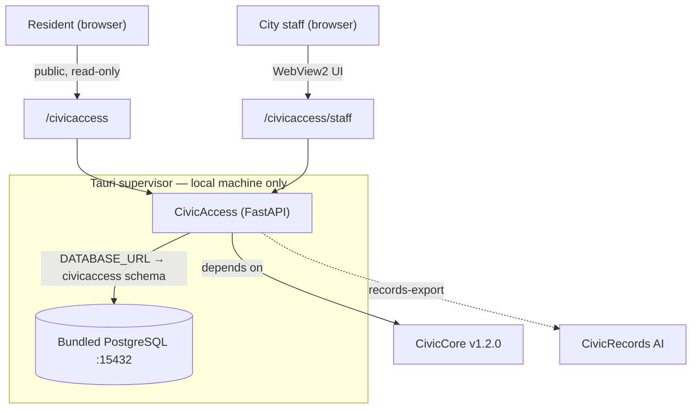

# GitHub Discussions Seed Posts

Seed posts for the CivicAccess Discussions board, organized by audience. Post the **civic-staff** set in a general/community category and the **technical** set in a development category.

---

## For civic staff

### 👋 Welcome — what CivicAccess does for your office

CivicAccess helps your office put out public notices, forms, and documents that **everyone can read** — and keep a clean record proving you checked.

- Paste a draft into the **public checker** for instant, plain-language fixes. Nothing is saved — it's a safe place to try things.
- Use the **staff workspace** to save a review on the record and export a records-ready package for public-records requests.
- It also rewrites jargon, drafts translations for a human reviewer, and walks ADA Title II reviews step by step.

This is an early release (v0.4.0) — great for evaluating and piloting. Tell us what would make it useful in your office.

### What should we help you review first?

Share examples of public notices, forms, agendas, PDFs, or documents where accessibility and plain-language support would help your city. Real examples shape what we build next.

### Where CivicAccess stops (and a human takes over)

CivicAccess is a tool for your staff, **not a rubber stamp.** It does not give legal advice, certify ADA compliance, or issue official translations, and it never publishes anything on its own. Staff reviewers, ADA coordinators, translators, and legal counsel always make the final call. Drafts it produces — especially translations — are starting points for a qualified human, not the final word.

---

## For IT & technical staff

### Architecture & how it runs

CivicAccess is a deterministic **FastAPI** module (no model/LLM calls, no outbound network), pinned to the published **CivicCore v1.2.0** release wheel. In CivicSuite Windows Local, a Tauri supervisor runs it against a bundled PostgreSQL on `127.0.0.1:15432` (dedicated `civicaccess` schema); the supervisor's backup captures the whole data directory.



Full API, data model, and security details: [README](../README.md) · [User Manual, Part 2](../USER-MANUAL.md#part-2--for-it--technical-staff).

### v0.4.0 — what changed

City-core hardening (closes probe gaps #2/#3/#4):

- **Persistence** now defaults to the shared CivicCore PostgreSQL (reads the supervisor's `DATABASE_URL`); SQLite is a dev fallback.
- **Write authz:** persistence routes (`/review`, `/reviews/{id}/records-export`) require `X-CivicAccess-Write-Token` (constant-time; 403 invalid / 503 if unconfigured). A new stateless `POST /analyze` powers the public surface so it never writes.
- **Audit:** every write/export persists an `audit_events` row; `review.create` is atomic with the record.
- The earlier `v1.0.0` tag was published in error and is retained only as historical evidence.

### Running it locally & the release gate

```bash
python -m pip install https://github.com/CivicSuite/civiccore/releases/download/v1.2.0/civiccore-1.2.0-py3-none-any.whl
python -m pip install -e ".[dev]"
python -m pytest -q
# Full release gate requires a real PostgreSQL:
export CIVICACCESS_POSTGRES_TEST_URL="postgresql+psycopg2://USER:PW@HOST:PORT/DB"
bash scripts/verify-release.sh
```

Questions about the module contract, integration contracts, or the desktop runtime wiring are welcome here.
